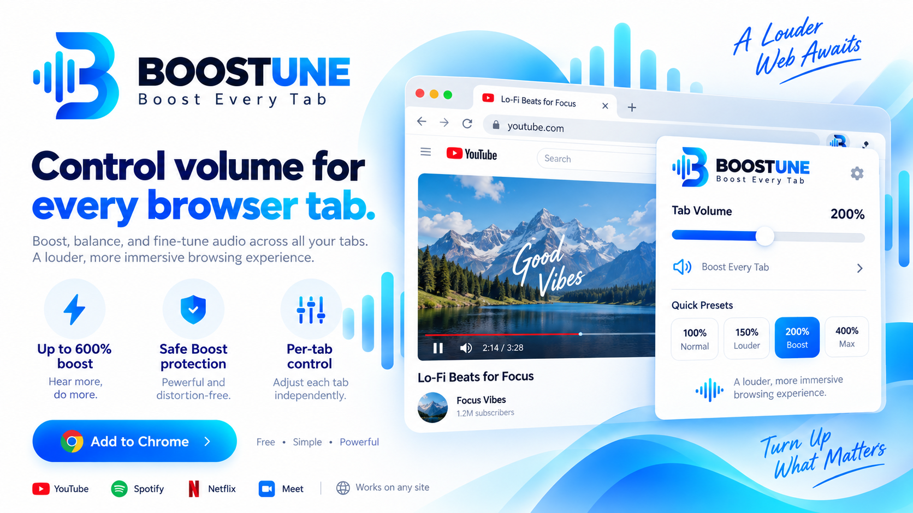
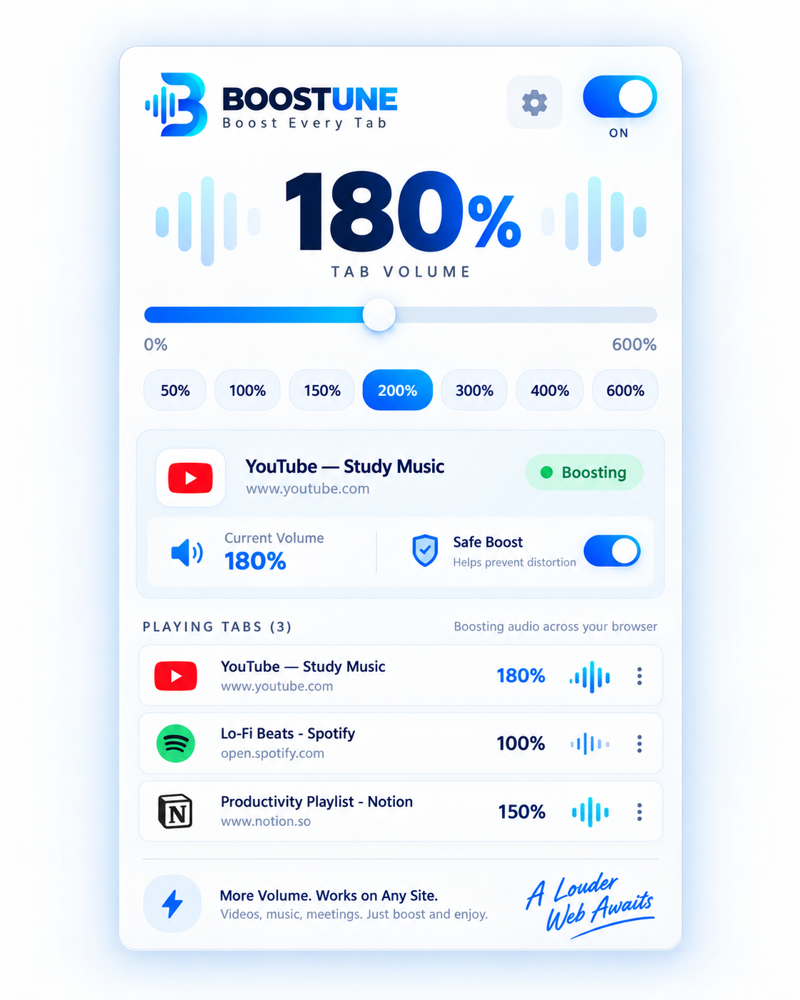
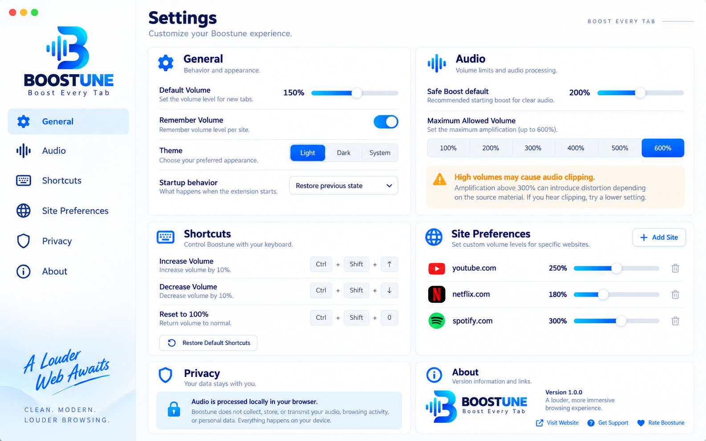
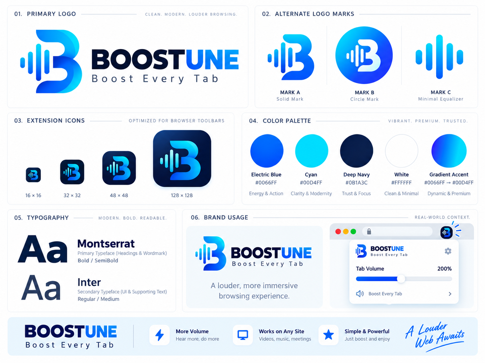

<div align="center">



<br/>
<br/>

[](https://github.com/MohammedShakib/Boostune)
[](https://developer.chrome.com/docs/extensions/mv3/intro/)
[](https://github.com/MohammedShakib/Boostune/releases)
[](LICENSE)
[](PRIVACY.md)

<h3>
  🔊 Boost, balance, and control audio for individual browser tabs.<br/>
  From 0% silence to 600% amplification — per tab, in real time.
</h3>

</div>

---

## ✨ Preview

<div align="center">



<br/><br/>



</div>

---

## 🚀 Features

| Feature | Description |
|:---:|:---|
| 🎚️ **Per-Tab Volume** | Independently control each tab from **0% to 600%** |
| 🛡️ **Safe Boost** | Built-in limiter/compressor to reduce clipping at high volumes |
| ⚡ **Quick Presets** | One-click preset buttons: 50%, 100%, 150%, 200%, 300%, 400%, 600% |
| 🎯 **Playing Tabs** | See all audio-producing tabs and their Boostune volumes at a glance |
| 💾 **Remember Volume** | Automatically restore volume per website (opt-in) |
| ⌨️ **Keyboard Shortcuts** | `Alt+↑` / `Alt+↓` / `Alt+Shift+0` for hands-free control |
| 🔒 **Privacy First** | Zero network requests · No audio recording · No analytics |
| 🌐 **Chrome & Edge** | Works on all Chromium-based browsers |

---

## 🏗️ Architecture

Boostune uses a clean, layered architecture where **audio never runs in the popup**:

```
Popup UI  (ephemeral — closes anytime)
    │  chrome.runtime messages
    ▼
Service Worker  (coordinates lifecycle)
    │  chrome.tabCapture.getMediaStreamId()
    │  chrome.offscreen.createDocument()
    ▼
Offscreen Document  (persistent audio host)
    │  navigator.mediaDevices.getUserMedia()
    ▼
AudioContext  (one per active tab)
    MediaStreamAudioSourceNode
    → GainNode          (0–600% volume)
    → DynamicsCompressor  (Safe Boost limiter)
    → AudioContext.destination
```

> **No echo guaranteed.** Chrome automatically mutes the browser's native tab audio when `tabCapture` is active — all sound routes exclusively through our AudioContext.

---

## 📦 Installation

### Load Unpacked (Developer Mode)

1. Clone or download this repository
```bash
git clone https://github.com/MohammedShakib/Boostune.git
```

2. Open **Chrome** and navigate to:
```
chrome://extensions
```

3. Enable **Developer mode** (top-right toggle)

4. Click **Load unpacked**

5. Select the `boostune-extension/` folder *(the one containing `manifest.json`)*

6. Pin Boostune to your toolbar — and you're ready! 🎉

> **Microsoft Edge:** Same steps at `edge://extensions`

---

## 🎮 How to Use

```
1.  Open any tab playing audio (YouTube, Spotify, a video call…)
2.  Click the Boostune icon in your toolbar
3.  Hit the toggle → status changes to Boosting ●
4.  Drag the slider or tap a preset to set your volume
5.  Each tab is fully independent — set them all differently
6.  Toggle off → audio returns to normal, no echo, no leftover sessions
```

---

## ⌨️ Keyboard Shortcuts

| Shortcut | Action |
|---|---|
| `Alt` + `↑` | Increase volume by 10% |
| `Alt` + `↓` | Decrease volume by 10% |
| `Alt` + `Shift` + `0` | Reset to 100% |

> Customise at `chrome://extensions/shortcuts`

---

## 🔐 Permissions

| Permission | Why It's Needed |
|---|---|
| `tabCapture` | Capture per-tab audio stream IDs |
| `offscreen` | Host a persistent AudioContext outside the popup |
| `storage` | Save your preferences & remembered site volumes |
| `tabs` | Read tab titles, favicons, and audible state |
| `activeTab` | Access current tab when popup opens |

> No host permissions (`<all_urls>`) are requested.

---

## 📁 Project Structure

```
boostune-extension/
├── manifest.json                        ← MV3 manifest
├── README.md · PRIVACY.md · TESTING.md
│
├── src/
│   ├── background/
│   │   └── service-worker.js            ← Session orchestration
│   ├── offscreen/
│   │   ├── offscreen.html               ← AudioContext host
│   │   └── offscreen.js                 ← Message router
│   ├── audio/
│   │   ├── audio-engine.js              ← AudioSession class
│   │   └── audio-session-manager.js     ← Per-tab session map
│   ├── popup/
│   │   ├── popup.html / .css / .js      ← Extension popup
│   ├── options/
│   │   ├── options.html / .css / .js    ← Settings page
│   ├── storage/
│   │   └── storage.js                   ← chrome.storage wrapper
│   └── shared/
│       ├── constants.js                 ← MSG types, VOLUME config
│       └── utils.js                     ← Logger, helpers
│
└── assets/
    ├── brand/                           ← Logo, waveform, badge
    ├── icons/                           ← icon16/32/48/128.png + SVG
    └── mockups/                         ← UI screenshots
```

---

## 🎨 Brand & Design

<div align="center">



</div>

---

## ⚠️ Known Limitations

| Limitation | Details |
|---|---|
| **DRM Content** | Netflix, Disney+ block `tabCapture` for encrypted streams — Boostune shows a graceful error |
| **Browser Pages** | `chrome://` and `edge://` pages cannot be captured by design |
| **SW Termination** | Chrome may idle-kill the service worker; sessions enter Error state and can be manually resumed |
| **One Capture Per Tab** | If another extension already captures the tab, Boostune will show a permission error |

---

## 🔒 Privacy

Boostune is **100% local**. It makes **zero network requests**.

- ✅ Audio processed entirely in your browser
- ✅ Nothing recorded, uploaded, or stored persistently
- ✅ No analytics, no telemetry, no third-party libraries
- ✅ No content scripts injected into websites

→ Read the full [Privacy Policy](PRIVACY.md)

---

## 🛠️ Development

No build step required — all files are plain ES modules.

```bash
# Edit source files, then reload the extension:
# chrome://extensions → Boostune → Refresh icon
```

**Debug logging** is enabled by default. All logs are prefixed `[Boostune]`.  
Set `DEBUG = false` in `src/shared/utils.js` before a production release.

---

## 🗺️ Roadmap (V2 Ideas)

- [ ] 📊 Live waveform / VU meter visualiser
- [ ] 🎛️ Per-tab equaliser (bass, mid, treble)
- [ ] 🏷️ Badge icon showing current volume %
- [ ] 🔇 Noise gate (auto-mute below threshold)
- [ ] 🌙 Light / dark theme toggle
- [ ] 📤 Export / import site preferences
- [ ] 🦊 Firefox support (MV2 port)

---

## 📄 License

MIT © [Mohammed Shakib](https://github.com/MohammedShakib)

---

<div align="center">


<br/>

**A Louder Web Awaits.** 🔊

<br/>

*Built with the Web Audio API · Manifest V3 · Chrome tabCapture*

</div>
